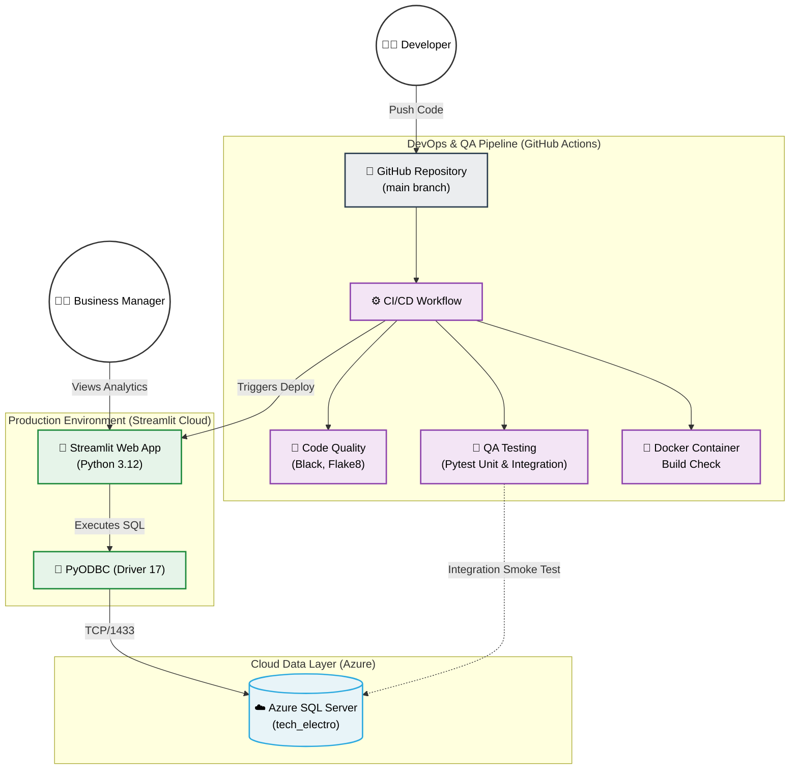

# TechElectro Inc. Inventory Optimization Dashboard
[](https://github.com/ReneilweKeoagile061/TechElectro/actions/workflows/ci.yml)

Data-driven inventory optimization project for TechElectro Inc., addressing overstocking, understocking, and customer satisfaction risk through Azure SQL cloud analytics, an interactive Streamlit dashboard, and a production-grade DevOps pipeline.

## 🚀 Live Application
**Dashboard:**  https://techelectro.streamlit.app/
**Database:** Hosted on Azure SQL Server (Serverless)

---

## 🏗️ Architecture & Tech Stack



| Component | Technology |
|---|---|
| **Cloud Database** | Azure SQL Server 2022 (Serverless) |
| **Backend & Scripting** | Python 3.12 |
| **DB Connectivity** | `pyodbc` (ODBC Driver 17 / 18) |
| **Data Manipulation** | `pandas`, `numpy` |
| **Visualization** | `plotly` |
| **Dashboard** | Streamlit |
| **CI/CD Pipeline** | GitHub Actions |
| **QA & Testing** | `pytest` (36 Unit/Integration tests) |
| **Containerization** | Docker |
| **Code Quality** | `black`, `flake8`, `pre-commit` |

---

## ⚙️ DevOps & QA Engineering

This project is built to production software engineering standards, ensuring high availability, code quality, and accurate inventory mathematics:

1. **GitHub Actions CI/CD:** Every push to `main` triggers an automated pipeline that checks code formatting, lints for errors, builds a test Docker container, and runs the full test suite.
2. **Automated Testing (`pytest`):** Contains 36 rigorous tests covering:
   - **Business Logic:** Validates the math behind safety stock, reorder points, standard deviation, and capital-tied-up.
   - **Data Filters:** Ensures sidebar logic (SKU search, category, promotions) works flawlessly.
   - **Integration (Smoke Tests):** Automatically connects to the Azure SQL Server during CI to verify schema integrity and row counts.
3. **Dockerization:** A multi-stage `Dockerfile` (Debian Linux) ensures the app can be deployed anywhere. It automatically installs the required Microsoft ODBC drivers and configures the Python environment.
4. **Pre-commit Hooks:** Enforces strict PEP-8 compliance (`black`, `flake8`) before code is ever committed to the repository.

---

## 🏃 How to Run the Project

### Option 1: Run with Docker (Recommended)
```bash
# Build the image
docker build -t techelectro-app .

# Run the container locally on port 8501
docker run -p 8501:8501 techelectro-app
```

### Option 2: Run Locally (Python Virtual Environment)
```bash
# Install production requirements
pip install -r requirements.txt

# Run the Streamlit dashboard
streamlit run app.py
```

### Option 3: Run the QA Test Suite
```bash
# Install development requirements
pip install -r requirements-dev.txt

# Run the 36 unit and integration tests
pytest tests/ -v
```

---

## 📊 Business Value & Key Findings

- **Capital at Risk:** Identified massive capital tied up in low-velocity stock (products moving at under 50% of their category's average demand).
- **Dynamic Safety Stock:** Calculated exact reorder points based on a 95% Target Service Level to prevent stockouts.
- **Statistical Truths:** 91.5% of products have only one sales record, making per-SKU demand volatility statistically uncomputable. Safety stock is calculated at the **category level** instead.
- **No Measurable Promotion Effect:** Promoted and non-promoted products show statistically indistinguishable average demand.

---

## 🔮 Future Improvements (Roadmap)

- [ ] **In-Database Transformations (dbt):** Move the heavy pandas calculations directly into Azure SQL using dbt to scale beyond memory limits.
- [ ] **Automated Ingestion (Airflow):** Build a daily ELT pipeline to mock incoming sales data and load it into Azure automatically.
- [ ] **Predictive ML:** Replace historical averages with a demand forecasting model (incorporating GDP and Inflation data) to predict future reorder points.

---

## 📂 Repository Contents

- `app.py` — Interactive Streamlit dashboard
- `.github/workflows/ci.yml` — Automated CI/CD pipeline
- `tests/` — Pytest suite (36 tests)
- `Dockerfile` / `.dockerignore` — Containerization configs
- `architecture.mmd` — Mermaid architecture diagram
- `Reliance Infosystems.sql` — Initial SQL schema and staging scripts
- `methodology_decisions.md` — Detailed rationale for technical decisions
- `requirements.txt` & `requirements-dev.txt` — Dependencies

Full methodology and architectural rationale can be found in [`methodology_decisions.md`](./methodology_decisions.md).
